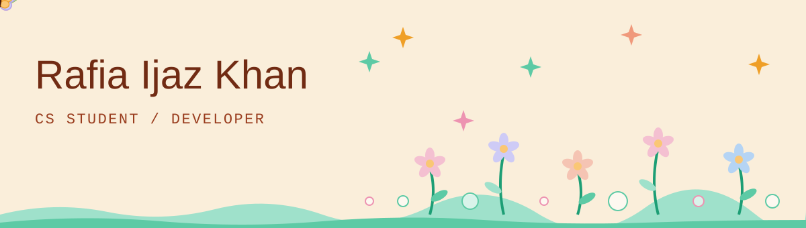
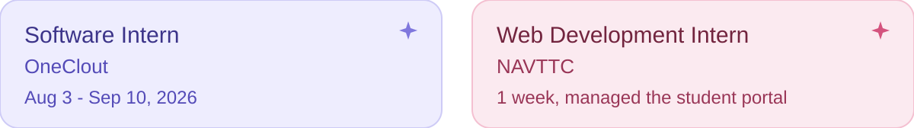
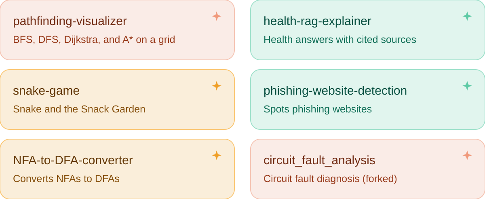

  

### ✦ About me

Hi, I'm Rafia, a CS student who enjoys learning new things, working on projects, and solving problems.

### ✦ Experience

  

### ✦ Skills

  <b>Frontend</b> 
  
  
  
  
  
  
  

  <b>Backend and APIs</b> 
  
  
  
  

  <b>ML, data, and RAG</b> 
  
  
  
  
  
  
  

  <b>Deployment and tools</b> 
  
  
  
  
  
  

### ✦ Projects

  

  <a href="https://github.com/Rafiaijazkhan/pathfinding-visualizer">pathfinding-visualizer</a> ·
  <a href="https://github.com/Rafiaijazkhan/health-rag-explainer">health-rag-explainer</a> ·
  <a href="https://github.com/Rafiaijazkhan/snake-game">snake-game</a> ·
  <a href="https://github.com/Rafiaijazkhan/phishing-website-detection">phishing-website-detection</a> ·
  <a href="https://github.com/Rafiaijazkhan/NFA-to-DFA-converter">NFA-to-DFA-converter</a> ·
  <a href="https://github.com/Rafiaijazkhan/circuit_fault_analysis">circuit_fault_analysis</a>

  

